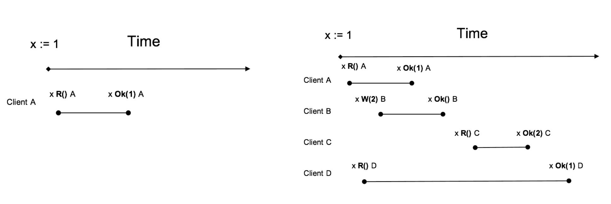

# Open-Raft

## a Java implementation of  raft protocol   
raft协议：https://raft.github.io/

#### Leader election

#### Log Replication and Recovery

#### Snapshot and log Compaction

#### MemberShip Change

#### Transfer Leader

#### Fault Tolerance

#### Workaround when quorate peers are dead

#### Symmetric network partition tolerance

#### Asymmetric network parttion tolerance

#### ReadIndex
什么是线性一致读? 所谓线性一致读，一个简单的例子是在 t1 的时刻我们写入了一个值，那么在 t1 之后，
我们一定能读到这个值，不可能读到 t1 之前的旧值(想想 Java 中的 volatile 关键字，即线性一致读就是在分布式系统中实现 Java volatile 语义)。
简而言之是需要在分布式环境中实现 Java volatile 语义效果，即当 Client 向集群发起写操作的请求并且获得成功响应之后，该写操作的结果要对所有后来的读请求可见。
和 volatile 的区别在于 volatile 是实现线程之间的可见，而 Open-Raft 需要实现 Server 之间的可见。

#### Batch

#### Replication pipeline

#### Append log in parallel

#### Asynchronous

#### Fully concurrent replicaiton

#### LeaseRead